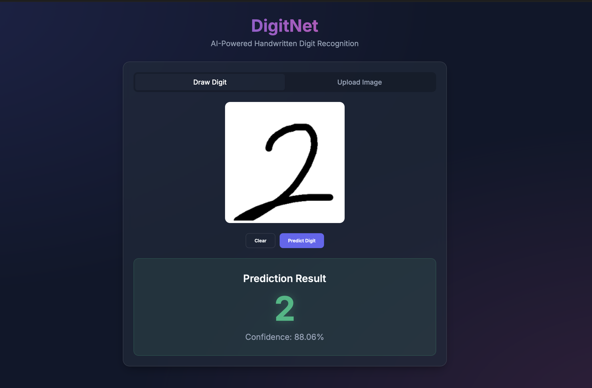
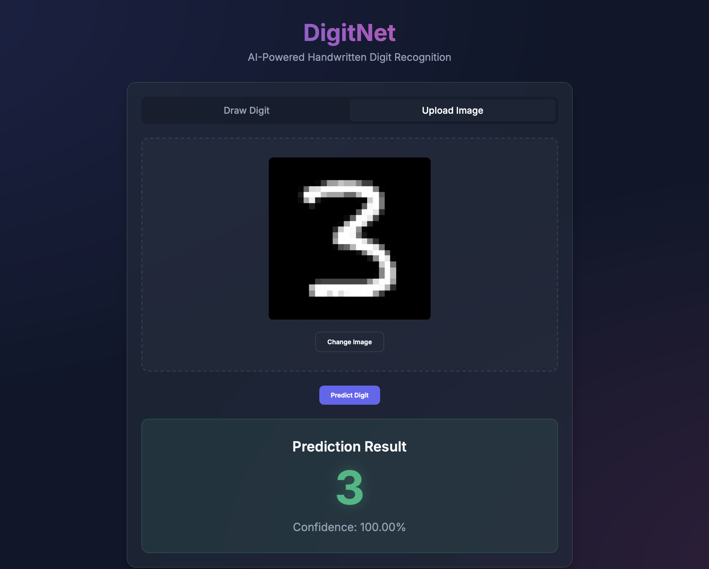

# DigitNet 🎨🔢

DigitNet is a full-stack, AI-powered web application that recognizes handwritten digits. You can draw a digit directly on a beautiful, glassmorphic canvas or upload an existing image, and the Convolutional Neural Network (CNN) will predict the digit with high accuracy.




## 🚀 Features

- **Draw Digit:** Interactive HTML5 canvas to draw digits directly on the screen using mouse or touch.
- **Upload Image:** Upload any image of a handwritten digit from your device.
- **Real-Time Prediction:** See the prediction and confidence score instantly.
- **Modern UI:** Built with Vite and React, featuring a sleek dark mode, vibrant gradients, and glassmorphism.

## 🏗️ Architecture & Tech Stack

- **Machine Learning:** Built with TensorFlow & Keras. A lightweight Convolutional Neural Network (CNN) trained on the MNIST dataset, achieving >98% accuracy.
- **Backend API:** Built with FastAPI (Python) to serve the model. It handles advanced image preprocessing (resizing, converting to grayscale, inverting colors, and normalizing) before feeding it to the model.
- **Frontend:** Built with React and Vite for blazing fast performance. Styled completely with Vanilla CSS using modern design tokens.

## 💻 How to Run Locally

### 1. Clone the repository
```bash
git clone https://github.com/coderashhar/DigitNet.git
cd DigitNet
```

### 2. Start the Backend (FastAPI)
Open a terminal and navigate to the `backend` folder:
```bash
cd backend
pip install -r requirements.txt
uvicorn main:app --reload
```
The backend server will run on `http://127.0.0.1:8000`.

### 3. Start the Frontend (Vite/React)
Open a second terminal and navigate to the `frontend` folder:
```bash
cd frontend
npm install
npm run dev
```
The frontend application will be available at `http://localhost:5173`.


